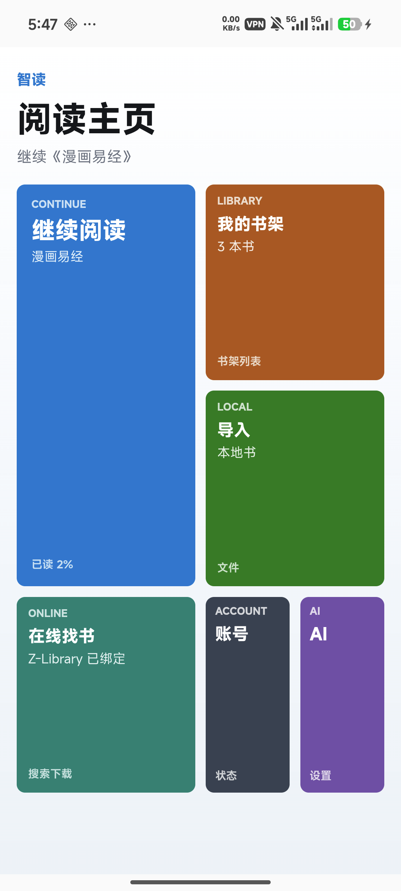
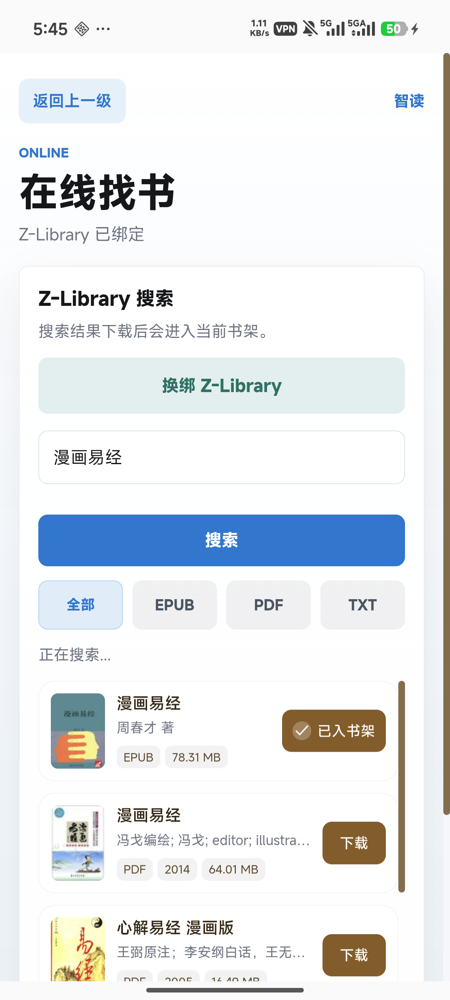
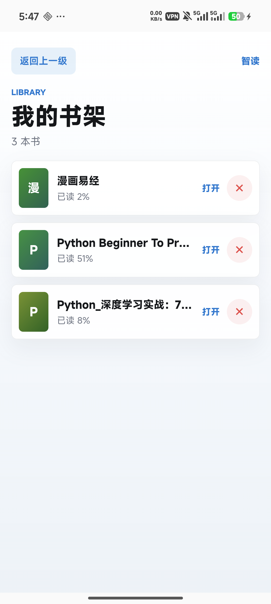
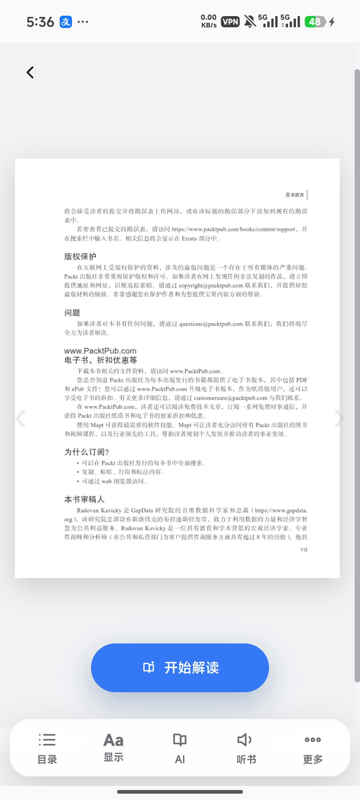

# SmartRead

SmartRead 是一个本地优先的 AI 阅读器，适合在 Android 手机或 Windows 电脑上导入 EPUB、PDF、TXT 后阅读、听书、做 AI 按页解读和管理个人书库。它支持自定义 OpenAI-compatible API，可以使用自己的 API Base URL、API Key 和模型名接入兼容服务。阅读时可以选择按原文直接朗读，也可以选择生成并收听 AI 解读。它的重点不是账号系统或云同步，而是把正文阅读、AI 解读、听书字幕、漫画和复杂图文混排内容做成可离线、自用、可控的单机体验。

## 应用功能特色

- 本地书架：导入的书籍和阅读进度保存在本机或手机本地，默认不依赖远程服务器。
- 多格式阅读：支持 EPUB、PDF、TXT，本地导入后可直接进入正文页阅读。
- 漫画和复杂图文：支持漫画书、扫描版 PDF 和复杂图文混排书籍的阅读场景。
- 自定义 AI 接口：支持 OpenAI-compatible API，可填写自己的 API Base URL、API Key 和模型名，不绑定单一服务商。
- AI 按页解读：对当前页、章节或选中文本生成解读，适合长文、专业书和图文混排内容。
- AI 聊天：阅读时可以围绕当前内容提问，适合查词、总结、解释段落和辅助理解。
- 听书模式：可选择按原文直接朗读，也可收听 AI 解读，支持当前句高亮、上一句、下一句和停止朗读。
- 字幕模式：支持字幕大、字幕小、字幕关闭，适合边听边看。
- 移动端阅读控件：底部功能栏固定在屏幕底部，不跟随正文滑动，不覆盖可阅读区域。
- 放大镜：正文页可双击开启或关闭放大镜，适合 PDF、扫描内容或小字号文本。
- Windows 页面缩放：桌面版的 PDF、图片页、EPUB 文字页和 TXT 文字页支持整页缩放与拖拽查看，不通过修改字号放大内容。
- 护眼和深色显示：阅读和听书控件会跟随主题，减少夜间阅读割裂感。
- Android 单机模式：APK 默认在手机本地运行，书架、AI 配置、在线书源配置和阅读状态都走本地存储。
- 内嵌找书入口：可搜索全球大量图书资源，覆盖小说、技术书、漫画书和图文混排书籍，实际可用性取决于外部书源状态。

## 界面截图

<table>
  <tr>
    <td align="center"><br>阅读主页</td>
    <td align="center"><br>搜书下载</td>
    <td align="center"><br>我的书架</td>
  </tr>
  <tr>
    <td align="center"><br>正文阅读</td>
    <td align="center"><br>听书模式</td>
    <td align="center"></td>
  </tr>
</table>

## 适合谁用

- 想在 Android 手机上看 EPUB、PDF、TXT 的用户。
- 想把 AI 按页解读、原文朗读和解读朗读放进同一个阅读界面的用户。
- 不想依赖云端账号，也不想把私人书库交给第三方服务的用户。
- 需要自己配置 API Key、自己控制数据和模型入口的用户。

## 下载安装

### Android APK

到 GitHub Release 下载 APK：

[BGsmartread.apk](https://github.com/xszwow/Smartread/releases/download/v0.1.0-android.1/BGsmartread.apk)

手机安装：

1. 打开上面的 APK 下载链接。
2. 下载完成后点开安装包。
3. 如果系统提示禁止安装未知来源应用，给浏览器或文件管理器开启“安装未知应用”权限。
4. 安装完成后打开 SmartRead。

当前 Android 安装包适合自用、测试和真机验证，不是 Play Store 生产签名包。

### Windows

到 GitHub Release 下载 Windows 安装包：

[SmartRead-Setup-0.1.0.exe](https://github.com/xszwow/Smartread/releases/latest/download/SmartRead-Setup-0.1.0.exe)

下载后运行安装包，或在本地构建后运行：

```powershell
.\release\"SmartRead Setup 0.1.0.exe"
```

或免安装启动：

```powershell
.\release\win-unpacked\SmartRead.exe
```

Windows 安装包当前为未签名测试分发版本，SmartScreen 可能提示风险；确认来源为本仓库 Release 后再继续安装。

## Android 使用说明

首次使用建议流程：

1. 安装 APK。
2. 打开应用进入书架。
3. 用“导入”添加 EPUB、PDF 或 TXT。
4. 进入正文页后，使用底部工具栏切换 AI、听书、字幕和放大镜。
5. 如需 AI 功能，在设置里填入自己的 OpenAI-compatible API Base URL、API Key 和模型名。

Android 端默认行为：

- 不要求登录远程 SmartRead 服务器。
- 书架、阅读进度和 AI 配置保存在设备本地。
- AI 接口由用户自行配置，支持 OpenAI 协议兼容服务。
- 听书优先使用 Android 原生 TextToSpeech。
- 语音输入优先使用 Android 系统语音识别，需要录音权限。

## 从源码构建

### 环境准备

当前项目的 `npm` 脚本按 Windows 工作区配置，会直接调用 `tools` 目录中的本地工具。构建前需要准备：

- Node.js 依赖：先运行 `npm install`。
- Windows 构建：确保存在 `tools\node-v24.15.0-win-x64\node.exe`。
- Android 构建：除 Node.js 外，还需要 `tools\jdk-21`、`tools\android-sdk\platforms\android-36` 和 `tools\android-sdk\build-tools\36.0.0`。
- `tools`、`release`、`mobile-www` 和签名证书目录均被 `.gitignore` 忽略，不会随 GitHub 源码自动下载，需要在构建电脑本地准备。

拉取代码并安装依赖：

```powershell
git clone -b 安卓 https://github.com/xszwow/Smartread.git
cd Smartread
npm install
```

### Web / 本地服务

Web 端不使用 Electron 的 `main.cjs`，而是编译并启动本地 server：

```powershell
npm run build
npm run dev
```

如需运行已编译的 server：

```powershell
npm run build
npm run start
```

### Windows 安装包

本次发布到 GitHub Release 的 Windows 安装包使用以下命令生成：

```powershell
npm run desktop:pack:win:unsigned
```

该命令会准备前端 vendor 资源、编译 TypeScript，并通过 Electron Builder 生成 NSIS 安装包。输出文件：

```text
release/SmartRead Setup 0.1.0.exe
release/SmartRead Setup 0.1.0.exe.blockmap
release/latest.yml
release/win-unpacked/SmartRead.exe
```

打包完成后，我用于验证 Windows 包的命令为：

```powershell
npm run desktop:smoke:packaged
npm run desktop:smoke:packaged:pdf-touch
npm run desktop:smoke:packaged:epub-image-touch
```

`desktop:pack:win:unsigned` 只生成 Windows 产物，不会构建、修改或上传 Android APK。该安装包没有正式公开代码签名，其他电脑运行时可能出现 SmartScreen 提示。

如果本机已有开发签名证书，可使用本地签名构建：

```powershell
npm run desktop:pack:win:dev-signed
npm run desktop:smoke:installed
```

正式公开分发需配置非开发版 Authenticode 证书后执行：

```powershell
npm run desktop:pack:win:production-signed
```

### Android APK / AAB

Android 使用 Capacitor，网页资源会先生成到 `mobile-www`，然后同步到 Android 工程。构建调试 APK：

```powershell
npm run android:build:debug
```

该命令会自动执行移动资源同步，再调用 Gradle 生成：

```text
android/app/build/outputs/apk/debug/app-debug.apk
```

安装到连接的 Android 设备：

```powershell
adb install -r .\android\app\build\outputs\apk\debug\app-debug.apk
```

生成 Android release APK 或 AAB：

```powershell
npm run android:build:release
npm run android:build:bundle
```

输出文件：

```text
android/app/build/outputs/apk/release/app-release.apk
android/app/build/outputs/bundle/release/app-release.aab
```

当前 GitHub 中现有的 `BGsmartread.apk` 不会随 Windows 构建流程改变。面向正式分发的 Android release 需要配置生产 keystore 或 Play App Signing，不要把 keystore、密码、API Key 或生产证书提交到仓库。

### 移动资源与检查

只准备 Capacitor Web 资源或同步原生工程时，可运行：

```powershell
npm run mobile:prepare
npm run mobile:sync
```

常用验证命令：

```powershell
npm test
npm run build
npm run native:standalone:audit
npm run native:backend:smoke
```

## 发布检查

发布前至少确认：

- `npm test` 通过。
- `npm run android:build:debug` 通过。
- APK 能用 `adb install -r` 覆盖安装。
- 真机能打开书架、导入书、进入正文页。
- AI、听书、字幕、放大镜和底部控件在手机端不遮挡正文。
- Android GitHub Release 的 Assets 里包含现有 `BGsmartread.apk`。
- Windows GitHub Release 的 Assets 里包含 `SmartRead-Setup-0.1.0.exe`。

## 当前仓库状态

- 当前主要开发分支：`安卓`
- Android 包名：`com.smartread.app`
- 当前应用版本：`1.0`
- 当前 npm 版本：`0.1.0`

## 相关文档

- 验证报告：`docs/verification-report.md`
- 发布状态：`docs/release-readiness-current.md`
- 功能覆盖矩阵：`docs/functional-test-matrix.md`

## 友情链接
linux.do
